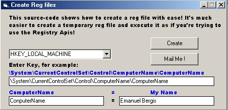

<div align="center">

## Create Reg files with ease


</div>

### Description

This code helps you to create reg files instead of using the Registry APIs! Got the idea from Alex Wied
 
### More Info
 


<span>             |<span>
---                |---
**Submitted On**   |2002-01-23 21:17:28
**By**             |[AvEnGeR](https://github.com/Planet-Source-Code/PSCIndex/blob/master/ByAuthor/avenger.md)
**Level**          |Beginner
**User Rating**    |4.0 (8 globes from 2 users)
**Compatibility**  |VB 3\.0, VB 4\.0 \(16\-bit\), VB 4\.0 \(32\-bit\), VB 5\.0, VB 6\.0
**Category**       |[Registry](https://github.com/Planet-Source-Code/PSCIndex/blob/master/ByCategory/registry__1-36.md)
**World**          |[Visual Basic](https://github.com/Planet-Source-Code/PSCIndex/blob/master/ByWorld/visual-basic.md)
**Archive File**   |[Create\_Reg505821232002\.zip](https://github.com/Planet-Source-Code/avenger-create-reg-files-with-ease__1-31103/archive/master.zip)

### API Declarations

```
Private Declare Function ShellExecute Lib "shell32.dll" Alias "ShellExecuteA" (ByVal hwnd As Long, ByVal lpOperation As String, ByVal lpFile As String, ByVal lpParameters As String, ByVal lpDirectory As String, ByVal nShowCmd As Long) As Long
```


